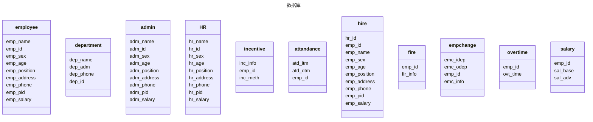

# <center> 后台数据库设计与实现的规范文档设计说明书</center>


<font size=5><center>**题		目 ：某单位人事管理系统**</center></font>

<font size =5><center>**班		级 ：21软件工程02**</center></font>

<font size =5><center>**学生姓名：Gtupxx**</center></font>

<font size = 5><center>**学生学号：\*\*\*\*\*\***</center></font>

<font size = 5><center>**指导老师：\*\*\*\***</center></font>


<div STYLE="page-break-after: always;"></div>

[TOC]

<div STYLE="page-break-after: always;"></div>

## 1、引言 

### 1.1  选题说明

随着市场经济的发展和竞争的加剧，人力资源作为企业最重要的战略资源，越来越受到企业管理者的重视。如何有效地管理和开发人力资源，提高员工的工作效率和满意度，成为企业提升核心竞争力和实现可持续发展的关键问题。人事管理系统作为一种现代化的人力资源管理工具，能够帮助企业实现人力资源信息化、自动化、智能化和规范化，从而提高企业人力资源管理水平和绩效。

本选题拟设计一个某单位的人事管理系统，该单位是一个中小型的制造企业，主要生产电子产品，有大约200名员工。该单位目前的人事管理工作还比较传统和落后，主要存在以下问题：

- 人事信息分散在各个部门，缺乏统一的管理和共享平台，导致信息不准确、不及时、不完整，影响决策效率和质量。
- 人事管理流程繁琐复杂，需要大量的人工操作和纸质文档，容易出错和遗漏，增加了管理成本和风险。
- 人事管理制度不健全，缺乏科学合理的薪酬体系、绩效考核体系、培训体系等，不能有效地激励和留住员工，影响员工的工作积极性和忠诚度。
- 人事管理功能单一，缺乏数据分析和决策支持，不能及时掌握员工的需求、能力、发展等情况，不能为企业战略规划和人才培养提供有效的指导和建议。

### 1.2 需求介绍

为了解决上述问题，提高该单位的人事管理水平和效果，本选题拟设计一个适合该单位特点和需求的人事管理系统。该系统将包括以下功能模块：

- 组织机构管理：建立该单位的组织结构图，定义各个部门、岗位、职级等信息，实现组织机构的动态调整和查询。
- 人员档案管理：建立员工的基本信息库，包括个人资料、学历、工作经历、合同、社保等信息，实现员工档案的录入、修改、查询、统计等功能。
- 考勤管理：设置考勤规则和排班计划，支持多种考勤方式（如指纹、刷卡、手机等），实现考勤数据的自动采集、汇总、分析等功能。
- 薪酬管理：设计薪酬方案和计算公式，根据考勤数据、绩效数据等自动计算员工的工资、奖金、福利等，并生成薪酬报表。
- 绩效管理：制定绩效目标和评估标准，通过在线或离线方式进行绩效打分，并自动计算绩效结果。
- 人才发展管理：分析员工的能力、潜力、职业倾向等，制定个人发展计划和职业生涯路径，为员工提供晋升、转岗、轮岗等机会，促进员工的个人成长和事业发展。
- 流程审批管理：建立各种人事管理流程，如入职、离职、调动、请假、报销等，实现流程的自动推进和提醒，提高审批效率和便捷性。
- 决策分析管理：利用人事管理数据，进行多维度、多角度的数据分析和可视化展示，为企业管理者提供人力资源状况的全面、准确、及时的信息，支持人力资源战略规划和决策制定。


## 2、功能需求分析

### 2.1 数据流图

本系统采用了模块化设计，主要子系统有：


​	


本系统数据库主要由以下几个表组成：





- **第0层数据流图:**

  

  

  

- **第1层数据流图：**


- **第2层数据流图：**


### 2.2 数据字典

#### 2.2.1 数据流条目


| 数据流名   | 说明                       | 数据流来源       | 数据流去向   | 数据流组成 |
| :--------- | :------------------------- | :--------------- | ------------ | ---------- |
| 登录信息   | 登陆者的账号密码           | 员工、管理员、HR | 人事管理系统 | 账号、密码 |
| 员工操作   | 员工使用系统是进行的操作   | 员工             | 人事管理系统 | 员工操作   |
| 管理员操作 | 管理员使用系统时进行的操作 | 管理员           | 人事管理系统 | 管理员操作 |
| HR操作     | HR使用系统时进行的操作   | HR | 人事管理系统 | HR操作 |
| 结果反馈 | 系统对操作做出的反馈 | 人事管理系统 | 员工、管理员、HR | 操作结果 |


| 数据流名         | 说明                           | 数据流来源   | 数据流去向   | 数据流组成                 |
| ---------------- | ------------------------------ | ------------ | ------------ | -------------------------- |
| 登录信息         | 员工登陆系统时所用的账号密码   | 员工         | 登陆系统     | 员工账号、密码             |
| 打卡信息         | 员工考勤打卡的信息             | 员工         | 考勤系统     | 员工号、当前时间           |
| 加班申请         | 员工申请进行加班的信息         | 员工         | 加班系统     | 员工号、加班信息           |
| 调动申请         | 员工申请调动的信息             | 员工         | 调动系统     | 员工号、调入部门、申请信息 |
| 结果反馈         | 员工登录的反馈                 | 登陆系统     | 员工         | 是否登录成功               |
| 工资             | 员工通过辛勤劳动获得的工资     | 工资系统     | 员工         | 金额                       |
| 加班信息         | 员工获取加班需求信息           | 加班系统     | 员工         | 加班需求信息               |
| 人事调动审核信息 | 管理员审核调动信息             | 管理员       | 人事调动系统 | 审核信息                   |
| 登录信息         | 管理员登陆系统时所用的账号密码 | 管理员       | 登陆系统     | 管理员账号、密码           |
| 发布加班信息     | 管理员发布加班信息             | 管理员       | 加班系统     | 加班信息                   |
| 发布奖惩信息     | 管理员对员工进行奖惩           | 管理员       | 奖惩系统     | 奖惩信息                   |
| 工资修改         | 管理员修改员工薪资             | 管理员       | 工资系统     | 工资变动信息               |
| 调动申请         | 管理员获取员工调动申请         | 人事调动系统 | 管理员       | 人事调动申请               |
| 结果反馈         | 管理员登录时的反馈             | 登陆系统     | 管理员       | 是否登陆成功               |
| 缺勤信息         | 管理员获取员工缺勤记录         | 考勤系统     | 管理员       | 员工缺勤信息               |
| 工资             | 管理员通过辛勤劳动获取的工资   | 工资系统     | 管理员       | 金额                       |
| 工资信息         | 管理员查询工资信息             | 工资系统     | 管理员       | 工资信息、员工信息         |
| 结果反馈         | HR登陆系统时的反馈             | 登陆系统     | HR           | 是否登录成功               |
| 工资             | HR通过辛勤劳动所获得的工资     | 工资系统     | HR           | 金额                       |
| 招聘信息         | HR获取招聘信息                 | 招聘系统     | HR           | 招聘信息                   |
| 登录信息         | HR登陆时输入的账号密码         | HR           | 登陆系统     | HR账号密码                 |
| 招聘结果         | HR招聘的结果                   | HR           | 招聘系统     | 招聘结果                   |
| 员工信息         | 员工信息                       | 员工表       | 登录系统     | 员工账号密码               |
| 管理员信息       | 管理员信息                     | 管理员表     | 登录系统     | 管理员账号密码             |
| HR信息           | HR信息                         | HR表         | 登录系统     | HR账号密码                 |
| 考勤信息         | 日常考勤信息                   | 考勤系统     | 考勤表       | 考勤信息                   |
| 缺勤信息         | 记录缺勤信息                   | 考勤表       | 考勤系统     | 缺勤信息                   |
| 加班信息         | 发布加班信息                   | 加班系统     | 加班表       | 加班信息                   |
| 加班信息         | 记录员工加班信息               | 加班表       | 工资系统     | 加班信息                   |
| 奖惩信息         | 通报奖惩信息                   | 奖惩系统     | 奖惩表       | 奖惩信息                   |
| 奖惩信息         | 员工奖惩信息                   | 奖惩表       | 工资系统     | 奖惩信息                   |
| 离职信息         | 记录员工离职信息               | 人事调动系统 | 离职表       | 离职信息                   |
| 调动信息         | 管理员审核调动信息             | 员工调动表   | 人事调动系统 | 调动信息                   |
| 调动信息         | 员工提交调动申请               | 人事调动系统 | 员工调动表   | 调动信息                   |
| 计算工资         | 工资系统用于计算工资           | 工资系统     | 工资信息表   | 工资信息                   |
| 工资修改结果     | 工资修改结果                   | 工资系统     | 工资信息表   | 工资信息                   |
| 招聘信息         | HR获取招聘信息                 | 招聘表       | 招聘系统     | 招聘信息                   |
| 招聘结果         | HR提交招聘结果                 | 招聘系统     | 招聘表       | 招聘结果                   |

#### 2.2.2 加工条目

| 加工名称         | 编号 | 激发条件             | 简述                           | 输入                 | 输出             | 逻辑             |
| ---------------- | ---- | -------------------- | ------------------------------ | -------------------- | ---------------- | ---------------- |
| 登陆验证         | 1.1  | 当有人提交登录申请时 | 验证登陆人员是否据哟是登录权限 | 登录信息             | 是否符合登陆条件 | 验证信息是否一致 |
| 每日打卡         | 2.1  | 每日员工打卡时       | 记录员工每日上下班打卡时间     | 打卡时间以及人员信息 | 考勤表           | 记录打卡时时间   |
| 缺勤记录         | 2.2  | 超过打卡最晚限度时   | 记录缺勤员工及其信息           | 缺勤人员             | 考勤表           | 记录未打卡人员   |
| 人事调动申请处理 | 3.1  | 员工提交调动申请后   | 收集员工提交的调动申请         | 调动申请             | 人事调动表       | 记录人事调动申请 |
| 人事调动申请审核 | 3.2  | 管理员审核调动申请   | 审核调动的申请                 | 审核结果             | 人事调动表       | 审核调动申请     |
| 加班公告发布     | 4.1  | 管理员发布加班公告   | 发布加班公告                   | 加班公告             | 加班表           | 记录加班公告     |
| 加班申请         | 4.2  | 员工主动申请加班     | 员工主动申请加班               | 加班申请             | 加班表           | 记录加班信息     |
| 自动奖惩         | 5.1  | 有员工缺勤时         | 出现缺勤是自动出发奖惩         | 缺勤表               | 奖惩表           | 记录奖惩信息     |
| 主动奖惩         | 5.2  | 管理员主动发布奖惩   | 管理员主动发布奖惩信息         | 奖惩信息             | 奖惩表           | 记录奖惩信息     |
| 工资查询         | 6.1  | 有人查询工资时       | 工资查询                       | 工资表以及人员信息   | 查询人           | 按员工号查询工资 |
| 发工资           | 6.2  | 每月月底             | 发工资                         | 工资表               | 无               | 发工资           |
| 招聘             | 7.1  | HR提交招聘信息       | HR提交所有通过面试人员         | 招聘信息             | 招聘表           | 记录招聘人员     |
| 招聘录入         | 7.2  | 提交招聘信息之后     | 自动将招聘人员添加到数据库中   | 招聘信息             | 员工表           | 录入招聘人员     |

#### 2.2.3 数据项条目

| 数据元素     | 中文名称         | 数据类型 | 长度          | 范围         | 描述                     |
| ------------ | ---------------- | -------- | ------------- | ------------ | ------------------------ |
| emp_name     | 员工姓名         | 字符型   | 不超过20字符  | 无           | 用于描述员工的姓名       |
| emp_id       | 员工编号         | 字符型   | 10字符        | 无           | 用于唯一确定一名员工     |
| emp_sex      | 员工性别         | 布尔类型 | 1bit          | 0或1         | 员工的性别               |
| emp_age      | 员工年龄         | 整形     | 不超过两字节  | 18-65        | 员工的年龄               |
| emp_position | 员工职位         | 字符型   | 不超过20字符  | 无           | 员工的职位               |
| emp_address  | 员工住址         | 字符型   | 不超过100字符 | 无           | 员工的住址               |
| emp_phone    | 员工电话         | 字符型   | 11字符        | 无           | 员工的电话               |
| emp_pid      | 员工身份证号     | 字符型   | 14字符        | 无           | 员工的身份证号           |
| emp_salary   | 员工薪资         | 浮点型   | 不超过8字节   | 非负         | 员工的薪资               |
| dep_name     | 部门名称         | 字符型   | 不超过20字符  | 无           | 部门的名称               |
| dep_adm      | 部门经理         | 字符型   | 10字符        | 无           | 部门经理的员工号         |
| dep_phone    | 部门电话         | 字符型   | 11字符        | 无           | 部门的电话               |
| dep_id       | 部门编号         | 字符型   | 10字符        | 无           | 部门的电话               |
| adm_name     | 管理员姓名       | 字符型   | 不超过20字符  | 无           | 管理员的姓名             |
| adm_id       | 管理员员工号     | 字符型   | 10字符        | 无           | 唯一确定一名管理员       |
| adm_sex      | 管理员性别       | 布尔型   | 1bit          | 0或1         | 管理员性别               |
| adm_age      | 管理员年龄       | 整形     | 不超过两字节  | 18-65        | 管理员年龄               |
| adm_position | 管理员职位       | 字符型   | 不超过20字符  | 无           | 管理员职位               |
| adm_address  | 管理员住址       | 字符型   | 不超过100字符 | 无           | 管理员住址               |
| adm_phone    | 管理员电话       | 字符型   | 11字符        | 无           | 管理员电话               |
| adm_pid      | 管理员身份证号   | 字符型   | 14字符        | 无           | 管理员身份证号           |
| adm_salary   | 管理员薪资       | 浮点型   | 不超过8字节   | 非负         | 管理员薪资               |
| hr_name      | HR姓名           | 字符型   | 不超过20字符  | 无           | HR姓名                   |
| hr_id        | HR员工号         | 字符型   | 10字符        | 无           | 唯一确定一名HR           |
| hr_sex       | HR性别           | 布尔型   | 1bit          | 0或1         | HR性别                   |
| hr_age       | HR年龄           | 整形     | 不超过两字节  | 18-65        | HR年龄                   |
| hr_position  | HR招聘职位       | 字符型   | 不超过20字符  | 无           | HR所招聘的职位           |
| hr_address   | HR住址           | 字符型   | 不超过100字符 | 无           | HR住址                   |
| hr_phone     | HR电话           | 字符型   | 11字符        | 无           | HR电话                   |
| hr_pid       | HR身份证号       | 字符型   | 14字符        | 无           | HR身份证号               |
| hr_salary    | HR薪资           | 浮点     | 不超过8字节   | 非负         | HR薪资                   |
| inc_info     | 奖惩信息         | 字符型   | 不超过200字符 | 无           | 奖惩信息                 |
| emp_id       | 奖惩员工号       | 字符型   | 10字符        | 无           | 奖惩员工号               |
| inc_meth     | 奖惩方法         | 字符型   | 不超过200字符 | 无           | 奖惩方法                 |
| atd_itm      | 签到时间         | 时间型   | 定长          | 6点到次日3点 | 签到时间                 |
| atd_otm      | 签退时间         | 时间型   | 定长          | 6点到次日3点 | 签退时间                 |
| emp_id       | 打卡员工号       | 字符型   | 10字符        | 无           | 打卡员工号               |
| hr_id        | HR员工号         | 字符型   | 10字符        | 无           | HR员工号                 |
| emp_id       | 招聘员工号       | 字符型   | 10字符        | 无           | 为刚招聘的员工分配的编号 |
| emp_name     | 招聘员工姓名     | 字符型   | 不超过20字符  | 无           | 招聘员工姓名             |
| emp_sex      | 招聘员工性别     | 布尔型   | 1bit          | 0或1         | 招聘员工性别             |
| emp_age      | 招聘员工年龄     | 整形     | 不超过两字节  | 18-65        | 招聘员工年龄             |
| emp_position | 招聘员工职位     | 字符型   | 不超过20字符  | 无           | 招聘员工职位             |
| emp_address  | 招聘员工住址     | 字符型   | 不超过100字符 | 无           | 招聘员工住址             |
| emp_phone    | 招聘员工电话     | 字符型   | 11字符        | 无           | 招聘员工电话             |
| emp_pid      | 招聘员工身份证号 | 字符型   | 14字符        | 无           | 招聘员工身份证号         |
| emp_salary   | 招聘员工薪资     | 浮点型   | 不超过8字节   | 非负         | 招聘员工薪资             |
| emp_id       | 离职员工号       | 字符型   | 10字符        | 无           | 离职员工号               |
| fir_info     | 离职信息         | 字符型   | 不超过200字符 | 无           | 离职信息                 |
| emc_idep     | 调动员工调出部门 | 字符型   | 10字符        | 无           | 调动员工调出部门         |
| emc_odep     | 调动员工调入部门 | 字符型   | 10字符        | 无           | 调动员工调入部门         |
| emp_id       | 调动员工号       | 字符型   | 10字符        | 无           | 调动员工号               |
| emc_info     | 调动信息         | 字符型   | 不超过200字符 | 无           | 调动信息                 |
| emp_id       | 加班员工号       | 字符型   | 10字符        | 无           | 加班员工的员工号         |
| ovt_time     | 加班时间         | 时间型   | 定长          | 无           | 某员工总加班时间         |
| emp_id       | 工资员工号       | 字符型   | 10字符        | 无           | 工资员工号               |
| salary_base  | 基础工资         | 浮点型   | 不超过8字节   | 非负         | 基础工资                 |
| salary_adv   | 附加工资         | 浮点型   | 不超过8字节   | 非负         | 附加工资                 |


### 2.3 功能需求分析

- 组织机构管理：建立该单位的组织结构图，定义各个**部门、岗位、职级**等信息，实现组织机构的**动态调整**和**查询**。
- 人员档案管理：建立员工的基本信息库，包括个人**资料、学历、工作经历、合同、社保**等信息，实现员工档案的**录入、修改、查询、统计**等功能。
- 考勤管理：设置考勤规则和排班计划，支持多种考勤方式（如指纹、刷卡、手机等），实现考勤数据的**自动采集、汇总、分析**等功能。
- 薪酬管理：设计薪酬方案和计算公式，根据考勤数据、绩效数据等自动**计算员工的工资、奖金、福利**等，并**生成薪酬报表**。
- 绩效管理：制定绩效目标和评估标准，通过在线或离线方式进行**绩效打分**，并自动**计算绩效结果**。
- 流程审批管理：建立各种人事管理流程，如**入职、离职、调动、请假、报销**等，实现流程的自动推进和提醒，提高审批效率和便捷性。

## 3、概念结构设计
### 3.1 局部E-R图
#### 3.1.1 员工

#### 3.1.2 管理员

#### 3.1.3 部门

#### 3.1.4 HR

#### 3.1.5 考勤系统

#### 3.1.6 奖惩系统

### 3.2 整体E-R图


## 4、逻辑结构设计

### 4.1 将E-R图转化为关系模式

将ER图转化为关系模式的**一般步骤**如下：

- 将每个**实体类型**转换成一个关系模式，实体的属性即为关系模式的属性，实体标识符即为关系模式的键。
- 将每个**二元联系类型**转换成一个关系模式，其属性为两端实体类型的键加上联系类型的属性，而键为两端实体键的组合。如果实体间联系是1:1或1:N，可以在一个关系模式的属性中加入另一个关系模式的键和联系类型的属性。
- 将每个**一元联系类型**转换成一个关系模式，其属性为实体类型的键加上联系类型的属性，而键为实体键和联系类型的组合。
- 将每个**三元或更高阶**的联系类型转换成一个关系模式，其属性为所有端实体类型的键加上联系类型的属性，而键为所有端实体键的组合

根据上述说明，我们不难得到以下关系模式(关系的码使用**<u>粗体加下划线</u>**表示):

员工(<u>**员工号**</u>, 姓名, 性别, 年龄, 职位, 地址, 电话, 身份证号, 薪资) 

管理员(**<u>员工号</u>**, 姓名, 性别, 年龄, 职位, 地址, 电话, 身份证号, 薪资) 

部门(<u>**部门号**</u>, 部门名称, 电话, 管理员) 

HR(**<u>员工号</u>**, 姓名, 性别, 年龄, 招聘职位, 地址, 电话, 身份证号, 薪资) 

考勤(<u>**员工号**</u>, 考勤时间) 

奖惩(,**<u>奖惩信息</u>**, 奖惩方法, 员工号)

### 4.2 关系模式分解

将一个关系模式转换成BCNF的**基本步骤**是：

1. 求出关系模式的**最小**函数依赖集。
2. 检查**每个**函数依赖是否满足BCNF条件，即左边是候选码或包含候选码。
3. 如果不满足，就将关系模式分解为两个子模式，一个包含函数依赖的左边和右边，另一个包含函数依赖的左边和原来的其他属性。
4. 重复步骤2和3，直到**所有**的子模式都满足BCNF条件。

不难看出上述的关系模式**已经满足BCNF**，不需要再做修改，因此最终的关系模式如下(关系的码使用**<u>粗体加下划线</u>**表示):

员工(<u>**员工号**</u>, 姓名, 性别, 年龄, 职位, 地址, 电话, 身份证号, 薪资) 

管理员(**<u>员工号</u>**, 姓名, 性别, 年龄, 职位, 地址, 电话, 身份证号, 薪资) 

部门(<u>**部门号**</u>, 部门名称, 电话, 管理员) 

HR(**<u>员工号</u>**, 姓名, 性别, 年龄, 招聘职位, 地址, 电话, 身份证号, 薪资) 

考勤(<u>**员工号**</u>, 考勤时间) 

奖惩(,**<u>奖惩信息</u>**, 奖惩方法, 员工号)

## 5、数据库设计

### 5.1 建立基本表

- 员工表：

```sql
create table employee(
    emp_id char(10) primary key,
    emp_name char(20) not null,
    emp_sex bit,
    emp_age int,
    emp_position char(20),
    emp_address char(200),
    emp_phone char(11),
    emp_pid char(18) not null,
    emp_salary float,
    emp_password nvarchar(20)
)
```


- 管理员表：

```sql 
create table admin(
	adm_id char(10) primary key,
    adm_name char(20) not null,
    adm_sex bit,
    adm_age int,
    adm_position char(20),
    adm_address char(100),
    adm_phone char(11) not null,
    adm_pid char(18),
    adm_salary float,
    adm_password nvarchar(20)
)
```


- HR表：

```sql
create table hr(
	hr_id char(10) primary key,
    hr_name char(20) not null,
    hr_sex bit,
    hr_age int,
    hr_position char(20),
    hr_address char(100),
    hr_phone char(11),
    hr_pid char(18),
    hr_salary float,
    hr_password nvarchar(20)
)
```


- 考勤表：

```sql
create table attandance(
		atd_itm datetime not null,
		atd_otm datetime not null,
		emp_id datetime primary key
	)
```


- 加班表：

```sql
create table overtime(
		emp_id char(10) primary key,
		ovt_time float
	)
```


- 奖惩表：

```sql
create table incentive(
		inc_info char(200),
		emp_id char(10) primary key,
		inc_meth float not null
	)
```

- 离职表：

```sql
create table fire(
	emp_id char(10) primary key,
    fir_info char(100)
)
```


- 员工调动表：

```sql
create table empchange(
	emp_id char(10) primary key,
    emc_idep char(20) not null,
    emc_odep char(20),
    emc_info char(100)
)
```


- 工资信息表：

```sql
create table salary(
	emp_id char(10) primary key,
    sal_base int
)
```


- 部门表：

```sql
create table department(
    dep_id char(10) primary key,
	dep_name char(20) not null,
    dep_phone char(11),
    dep_admin char(10)
)
```


- 招聘表：

```sql
create table hire(
		hr_id char(10) primary key,
		emp_id char(10) not null,
		emp_name char(20) not null,
		emp_sex bit,
		emp_age int,
		emp_position char(10),
		emp_address char(200),
		emp_phone char(11),
		emp_pid char(18),
		emp_salary float
)
```


### 5.2 建立索引

- 为员工表的emp_name字段创建一个索引：

```sql
CREATE INDEX idx_emp_name ON employee (emp_name)
```

- 为员工表的emp_position和emp_salary字段创建一个**复合索引**：

```sql
CREATE INDEX idx_emp_position_salary ON employee (emp_position, emp_salary)
```

- 为管理员表的adm_phone字段创建一个**唯一索引**：

```sql
CREATE UNIQUE INDEX idx_adm_phone ON admin (adm_phone)
```

- 为部门表的dep_admin字段创建一个**外键索引**：

```sql
ALTER TABLE department ADD FOREIGN KEY (dep_admin) REFERENCES admin (adm_id)
```


### 5.3 建立视图

- 显示员工的**姓名**，**职位**和工资：

```sql
CREATE VIEW emp_view AS
SELECT emp_name, emp_position, emp_salary
FROM employee;
```

- 显示部门的**名称**，**电话**和**管理员姓名**：

```sql
CREATE VIEW dep_view AS
SELECT d.dep_name, d.dep_phone, a.adm_name
FROM department d
JOIN admin a ON d.dep_admin = a.adm_id;
```

- 显示员工的**姓名**，**考勤时间**和**加班时间**：

```sql
CREATE VIEW atd_view AS
SELECT e.emp_name, a.atd_itm, a.atd_otm, o.ovt_time
FROM employee e
JOIN attandance a ON e.emp_id = a.emp_id
LEFT JOIN overtime o ON e.emp_id = o.emp_id;
```

- 显示员工的**姓名**，**奖惩信息**和**方法**：

```sql
CREATE VIEW inc_view AS
SELECT e.emp_name, i.inc_info, i.inc_meth
FROM employee e
JOIN incentive i ON e.emp_id = i.emp_id;
```

- 显示员工的**姓名**，**离职信息**和**原因**：

```sql
CREATE VIEW fir_view AS
SELECT e.emp_name, f.fir_info
FROM employee e
JOIN fire f ON e.emp_id = f.emp_id;
```

- 显示员工的**姓名**，**调动前后的部门**和**原因**：

```sql
CREATE VIEW emc_view AS
SELECT e.emp_name, c.emc_idep, c.emc_odep, c.emc_info
FROM employee e
JOIN empchange c ON e.emp_id = c.emp_id;
```

以上是一些示例，你可以参考MySQL的官方文档了解更多关于视图的信息。

### 5.4 建立存储过程

- 查询员工的基本信息和工资信息。

```sql
create procedure sp_query_emp_info
@emp_id char(10)
as
begin
select e.*, s.* from employee e
join salary s on e.emp_id = s.emp_id
where e.emp_id = @emp_id
end
```
- 插入一条新的招聘记录。
```sql
create procedure sp_insert_hire_record
@emp_id char(10),
@emp_name char(20),
@emp_sex bit,
@emp_age int,
@emp_position char(10),
@emp_address char(200),
@emp_phone char(11),
@emp_pid char(14),
@emp_salary float,
@hr_id char(10)
as
begin
insert into employee values (@emp_id, @emp_name, @emp_sex, @emp_age, @emp_position, @emp_address, @emp_phone, @emp_pid, 'hire', null)
insert into salary values (@emp_id, @emp_salary, null)
insert into hire values (@hr_id, @emp_id)
end
```
- 更新一个员工的奖惩信息。
```sql
create procedure sp_update_inc_info
@inc_info char(200),
@inc_meth int,
@emp_id char(10)
as
begin
update incentive set inc_info = @inc_info, inc_meth = @inc_meth where emp_id = @emp_id
end
```
- 删除一个离职的员工。
```sql
create procedure sp_delete_fire_emp
@emp_id char(10)
as
begin
delete from employee where emp_id = @emp_id and emp_status = 'fire'
delete from salary where emp_id = @emp_id
delete from incentive where emp_id = @emp_id
delete from fire where emp_id = @emp_id
end
```

- 查询一个部门的所有员工的信息。
```sql
create procedure sp_query_dep_emp
@dep_id char(10)
as
begin
select e.*, s.* from employee e
join salary s on e.emp_id = s.emp_id
join department d on e.emp_position = d.dep_name
where d.dep_id = @dep_id
end
```
- 插入一条新的考勤记录。
```sql
create procedure sp_insert_atd_record
@emp_id char(10),
@atd_itm datetime,
@atd_otm datetime
as
begin
insert into attandance values (@emp_id, @atd_itm, @atd_otm)
end
```
- 更新一个员工的工资信息。
```sql
create procedure sp_update_sal_info
@emp_id char(10),
@sal_base int,
@sal_adv int
as
begin
update salary set sal_base = @sal_base, sal_adv = @sal_adv where emp_id = @emp_id
end
```
- 删除一个部门。
```sql
create procedure sp_delete_dep
@dep_id char(10)
as
begin
delete from department where dep_id = @dep_id
delete from employee where emp_position in (select dep_name from department where dep_id = @dep_id)
delete from salary where emp_id in (select emp_id from employee where emp_position in (select dep_name from department where dep_id = @dep_id))
delete from incentive where emp_id in (select emp_id from employee where emp_position in (select dep_name from department where dep_id = @dep_id))
delete from fire where emp_id in (select emp_id from employee where emp_position in (select dep_name from department where dep_id = @dep_id))
delete from hire where emp_id in (select emp_id from employee where emp_position in (select dep_name from department where dep_id = @dep_id))
end
```

- 查询一个员工的所有加班记录。
```sql
create procedure sp_query_emp_ot
@emp_id char(10)
as
begin
select * from overtime where emp_id = @emp_id
end
```
- 插入一条新的加班记录。
```sql
create procedure sp_insert_ot_record
@emp_id char(10),
@ovt_time int
as
begin
insert into overtime values (@emp_id, @ovt_time)
end
```
- 更新一个员工的加班时间。
```sql
create procedure sp_update_ot_time
@emp_id char(10),
@ovt_time int
as
begin
update overtime set ovt_time = @ovt_time where emp_id = @emp_id
end
```
- 删除一个员工的所有加班记录。
```sql
create procedure sp_delete_emp_ot
@emp_id char(10)
as
begin
delete from overtime where emp_id = @emp_id
end
```

### 5.5 建立触发器

- 当员工表的数据插入或更新时，自动更新工资信息表。
```sql
create trigger tr_update_sal_info on employee
after insert, update
as
begin
declare @emp_id char(10)
declare @emp_salary float
select @emp_id = emp_id, @emp_salary = emp_salary from inserted
update salary set sal_base = @emp_salary where emp_id = @emp_id
end
```
- 当员工表的数据删除时，自动删除相关的考勤记录。
```sql
create trigger tr_delete_atd_record on employee
after delete
as
begin
declare @emp_id char(10)
select @emp_id = emp_id from deleted
delete from attandance where emp_id = @emp_id
end
```
- 当奖惩表的数据插入或更新时，自动调整员工的工资。
```sql
create trigger tr_adjust_sal on incentive
after insert, update
as
begin
declare @emp_id char(10)
declare @inc_meth int
select @emp_id = emp_id, @inc_meth = inc_meth from inserted
update salary set sal_adv = sal_adv + @inc_meth where emp_id = @emp_id
end
```

- 当考勤表的数据插入或更新时，自动计算员工的加班时间。

```sql
create trigger tr_calculate_ot_time on attandance
after insert, update
as
begin
declare @emp_id char(10)
declare @atd_itm datetime
declare @atd_otm datetime
declare @ovt_time int
select @emp_id = emp_id, @atd_itm = atd_itm, @atd_otm = atd_otm from inserted
set @ovt_time = datediff(minute, dateadd(hour, 8, @atd_itm), @atd_otm)
if @ovt_time > 0
begin
insert into overtime values (@emp_id, @ovt_time)
end
end
```
- 当加班表的数据插入或更新时，自动调整员工的工资。
```sql
create trigger tr_adjust_sal_ot on overtime
after insert, update
as
begin
declare @emp_id char(10)
declare @ovt_time int
select @emp_id = emp_id, @ovt_time = ovt_time from inserted
update salary set sal_adv = sal_adv + @ovt_time * 10 where emp_id = @emp_id
end
```
- 当员工调动表的数据插入或更新时，自动更新员工表的职位信息。
```sql
create trigger tr_update_emp_position on empchange
after insert, update
as
begin
declare @emp_id char(10)
declare @emc_idep char(20)
select @emp_id = emp_id, @emc_idep = emc_idep from inserted
update employee set emp_position = @emc_idep where emp_id = @emp_id
end
```

- 当离职表的数据插入或更新时，自动更新员工表的状态信息。

```sql
create trigger tr_update_emp_status on fire
after insert, update
as
begin
declare @emp_id char(10)
select @emp_id = emp_id from inserted
update employee set emp_status = 'fire' where emp_id = @emp_id
end
```
- 当招聘表的数据插入或更新时，自动更新员工表的状态信息。
```sql
create trigger tr_update_emp_status_hire on hire
after insert, update
as
begin
declare @emp_id char(10)
select @emp_id = emp_id from inserted
update employee set emp_status = 'hire' where emp_id = @emp_id
end
```
- 当员工表的数据插入或更新时，自动更新部门表的管理员信息。
```sql
create trigger tr_update_dep_admin on employee
after insert, update
as
begin
declare @emp_id char(10)
declare @emp_position char(20)
declare @emp_role char(10)
select @emp_id = emp_id, @emp_position = emp_position, @emp_role = emp_role from inserted
if @emp_role = 'admin'
begin
update department set dep_admin = @emp_id where dep_name = @emp_position
end
end
```

## 6、收获与感想

### 6.1 系统特点

本系统的主要设计如下：

- 使用**C++**进行后端的开发，**vue3**进行前端的开发，具有良好的**兼容性和易用性**；

- 采用**关系型数据库**存储数据，保证数据的**安全性和完整性**。

- 采用**模块化设计**，实现功能的**高内聚、低耦合**，便于系统的维护和扩展。

该系统的设计和实现将有助于该单位提高人事管理水平和效果，为企业发展提供有力的人力资源保障。

### 6.2 不足之处

尽管我已经尽力完成了这个人事管理系统的数据库大作业，但我也意识到了自己的不足之处。首先，我对数据库的理论知识还不够扎实，有些概念和原理还不够清楚，需要进一步学习和巩固。其次，我对数据库的设计和实现还不够熟练，有些功能和细节还不够完善，需要进一步改进和优化。最后，我对数据库的应用和创新还不够广泛，有些场景和需求还没有考虑到，需要进一步探索和拓展。

### 6.3 收获

通过这次数据库大作业，我学习了如何设计和实现一个人事管理系统，包括需求分析、概念结构设计、逻辑结构设计、物理结构设计、数据库实施和界面开发等步骤。我了解了人事管理系统的主要功能和数据需求，如员工信息管理、部门信息管理、签到签离、工资信息管理、员工签到管理和人员调动管理等。我掌握了使用MySQL语言和C++语言进行数据库操作和界面设计的方法和技巧，如创建表、视图、存储过程、触发器等对象。我也遇到了一些困难和挑战，如如何保证数据的完整性、一致性和安全性，如何优化数据库的性能和效率，如何处理异常和错误等。我通过查阅资料、请教同学和老师、反复测试和修改等方式解决了这些问题，提高了我的动手能力和解决问题能力。总之，这次数据库大作业让我对数据库的理论知识和实践技能有了更深入的理解和掌握，也增强了我的兴趣和信心，为今后的学习和工作打下了坚实的基础。

## 参考资料
- 基于 Java 的人事管理系统的设计与实现 - 知乎 - 知乎专栏. https://zhuanlan.zhihu.com/p/464734556.
- 企业人事管理系统类毕业论文文献有哪些？ - 知乎专栏. https://zhuanlan.zhihu.com/p/460615641.
- 基于Java和IntelliJ IDEA的人事管理系统设计与实现 毕业论文+项目源码及数据库文件. https://blog.csdn.net/m0_63680064/article/details/121075170.

## 致谢
在本论文的撰写过程中，我得到了我的指导老师\*\*\*老师的悉心指导和帮助。她不仅在专业知识和技能方面给予了我很多的启发和建议，还在论文的结构和格式方面给予了我很多的修改和完善。她的严谨的治学态度和高尚的师德风范深深地感染了我，使我受益匪浅。在此，我向我的指导老师表示最诚挚的感谢和敬意！
同时，我得到了很多人和资源的帮助和支持。在此，我要特别感谢newbing这个优秀的搜索引擎，它为我提供了丰富的信息和灵感，让我能够顺利地完成我的任务。
另外，我的舍友同样对我有很多的无私帮助与亲切问候在此，我向我的舍友们表示最诚挚的感谢和敬意！
如果没有你们的帮助，我可能无法再如此短的时间内完成对本系统的设计！